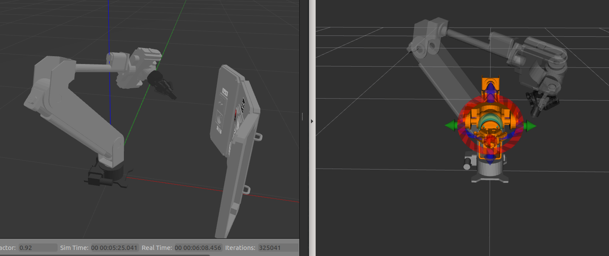
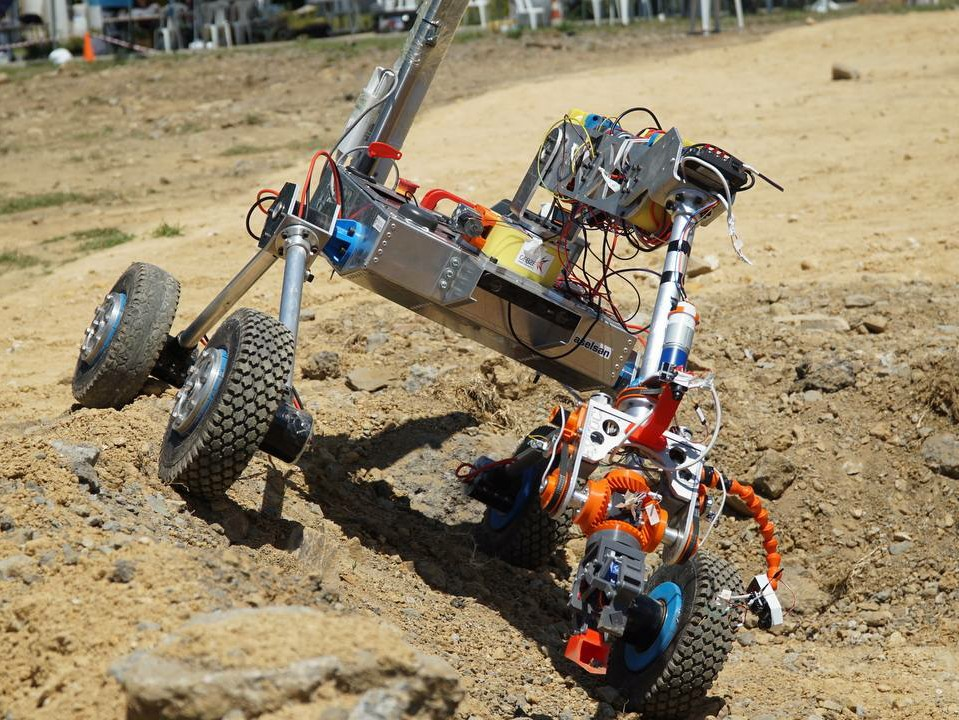

# ws_polar2
Second generation Polar Arm control software built with MoveIt by [GTU Rover](https://rover.gtu.edu.tr). A 6-dof mobile manipulator designed for Mars missions. Includes a Gazebo simulation environment and hardware controllers to drive real robot. 

Competed in University Rover Challenge 2022 and Anatolian Rover Challenge 2022.



 


### Installation
```bash
# Install
mkdir -p ws_polar2/src
cd ws_polar2/src
git clone <this_repo>
rosdep install -y --from-paths . --ignore-src --rosdistro melodic

# Build
cd ..
catkin config --extend /opt/ros/${ROS_DISTRO} --cmake-args -DCMAKE_BUILD_TYPE=Release
catkin build
source devel/setup.bash
```

### Run
Run simulation. 
```bash
roslaunch polar_simulation polar_simulation.launch
```

Bringup launcher for driving the real arm.
```bash
roslaunch polar_control polar_hw.launch
bash joint_driver/run.sh # or rosrun joint_driver runAll.py
```

Launch joystick controller.
```bash
roslaunch jog_launch polar.launch use_joy:=true
```

### Debug/Modify
Modify MoveIt configuration.
```bash
roslaunch moveit_setup_assistant setup_assistant.launch 
``` 

Test configuration.
```bash
roslaunch polar_moveit_config demo.launch 
```

### Package Details
Commit history is clear, for more details recommended to follow them.
Physical joint limits(position, velocity, torque) needs to be measured after production and applied to arm description and configurations.

* **polar_description:** Description package of robot generated by Fusion2Urdf and modified by hand. 

  >   Before generating the URDF/Xacro, optimize the CAD drawing. 
  >   1. Combine each seperate link as one solid body. 
  >   2. Then simplify. Delete unnecessary faces like fillets, gear teeth, inner spaces and objects like bolts, nuts, anything smaller than 5cm. 
  >
  >   No need for mechanical components, complex faces in mesh to calculate collisions. It will take too much computation. 

* **polar_moveit_config:** MoveIt config(joint limits, joint names, and kinematic properties) and launch(robot description, planning scene, motion planner, and trajectory executor) files. 

* **polar_simulation:** Setups the simulation world. Launches Gazebo from polar_gazebo, MoveGroup, Rviz and spawns the panel.

* **polar_control:** Handling ROS control loop and converting movement of differantial wrist. Derives from ros_control_boilerplate. Publishes commands to /roboclaw/command. And listening back feedback from /roboclaw/feedback. 

* **joint_driver:** Handling hardware communication. Listens /roboclaw/command and drives motor drivers. Reads encoder values from motor driver and publish back to /roboclaw/feedback. 


---


#### Resources
* http://docs.ros.org/en/melodic/api/moveit_tutorials/html/doc/getting_started/getting_started.html
* https://github.com/erdalpekel/panda_simulation
* https://erdalpekel.de/
* https://github.com/sgzuccaro/moveit_tutorials
* https://github.com/nasa-jpl/osr-rover-code/blob/master/ROS/osr/src/roboclaw.py
* http://wiki.ros.org/ros_control 
* http://wiki.ros.org/rosbridge_suite 
* http://wiki.ros.org/urdf/XML 

#### Tools
* https://github.com/syuntoku14/fusion2urdf
* https://www.meshlab.net/
* https://www.blender.org/ 
* https://marketplace.visualstudio.com/items?itemName=smilerobotics.urdf
